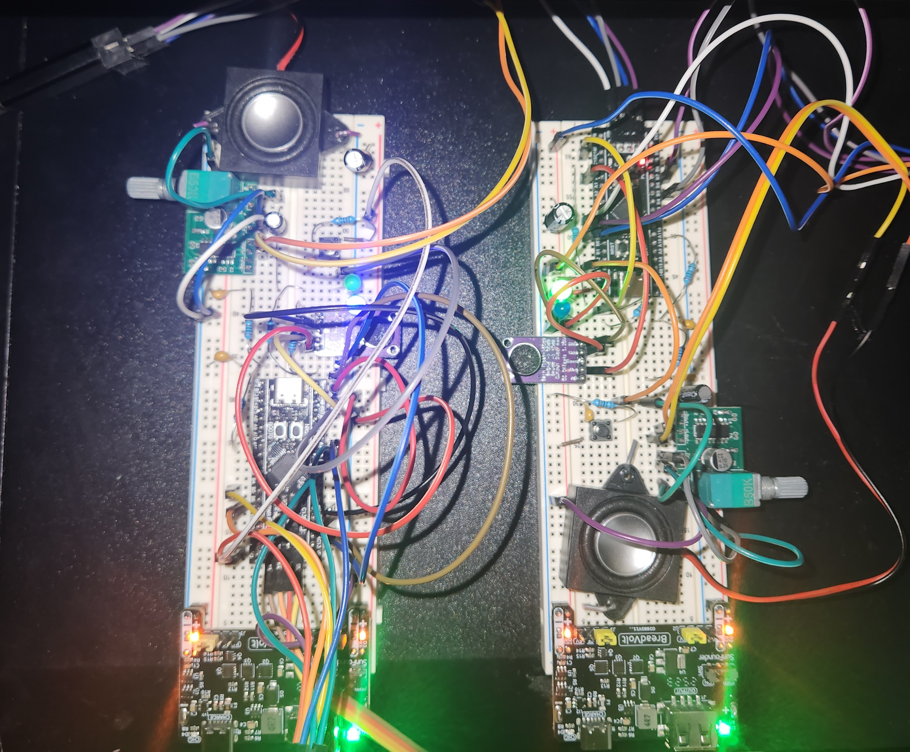
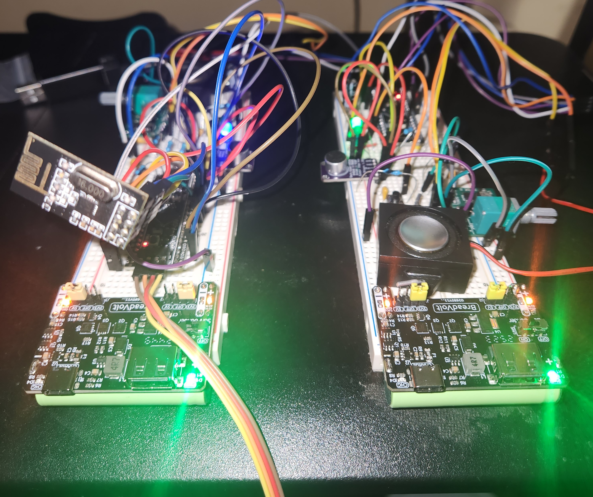

# 📡 STM32 Walkie-Talkie

- Real-time digital walkie-talkie built with **STM32F411**, sampling microphone audio using **ADC + DMA** and sending 32-byte PCM packets over **NRF24L01** at 2 Mbps.  
- Uses **double-buffered DMA** for uninterrupted audio capture and a **timer-driven PWM DAC** for smooth audio playback through a **PAM8403 amplifier** and speaker.  
- Implements a **ring buffer** on the receiver to handle jitter and maintain continuous audio output.  
- Features an **EXTI button** allowing instant switching between **Transmit** and **Receive** modes.  
- Hardware includes a **MAX9814 microphone**, NRF24L01 radio with **power capacitor stabilization**, and simple low-pass filtering for cleaner sound.  

